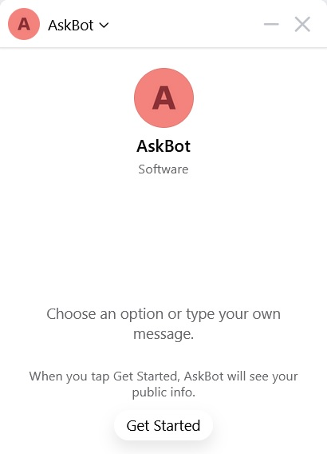
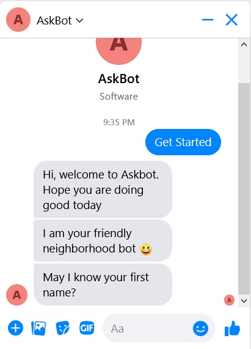
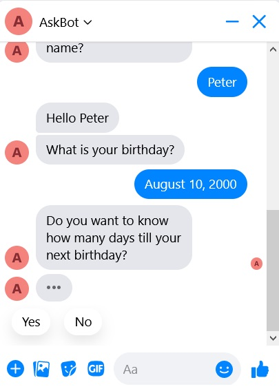
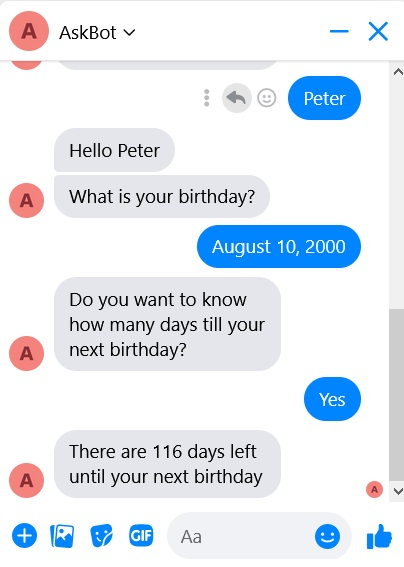

# AskSteve Messenger Chatbot
### Installation Instructions
- Make sure you have Node.js installed.    
- I used local database when making it so you can also install them if you want (I installed xampp with the database included in its package).
- Install dependencies.
`npm install`
- To start the server.
`npm start`
- Edit file .env to add your own Facebook page access token and verification token.    
- You can use ngrok to publicize your local network to get HTTPS URL

### Endpoints for viewing or deleting message(s)
- To view all messages
`/messages`
- To view message with a certain id
`/messages/message?id=YOUR_ID`
- To delete message with a certain id
`/messages/delete?id=YOUR_ID`

### Screenshots

